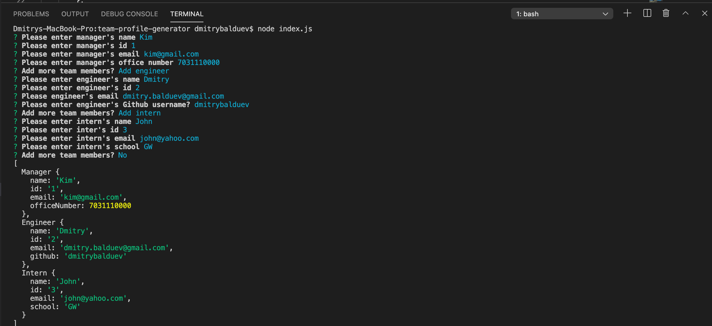

# Team Profile Generator

## Table of Content
[1 - Description](##Description) 
[2 - Installation Instructions](##Installation-Instructions) 
[3 - Usage](##Usage) 
[4 - Tools](##Tools) 

## Description

This is a simple command-line application to help user generate a html file which will contain information about employees. HTML file has a header and cards that has 3 types of employees (Manager, Intern and Engineer). When clicking on GitHub username user will be redirected to Github page. When clicking on email field, user will be redirected to default email program.

## Installation Instructions

MacOS users:
1. Make sure you have HomeBrew installed on Mac
2. Install npm by running "brew install npm"
3. Clone or download the project and navigate to repository directory by using command line
4. In order to resolve dependencies run "npm i"

## Usage

1. From root directory run command "node index.js" 
2. When done, index.html file will be generated, you can open it from browser

Here is short walkthrough video [click here](https://drive.google.com/file/d/1vmXvkQN55AsnPWlFSHKZR7dzP65-axc5/view)

Here are samples of how command line looks like and sample HTML file:

## Tools

This application was developed using Node JS. "fs" module was used to interact with file system. "Inquirer" module was used to promt questions on command line. This application also has unit tests written with Jest. In order to run unit tests execute script "npm run test1". Visual Studio code was used as a IDE. 